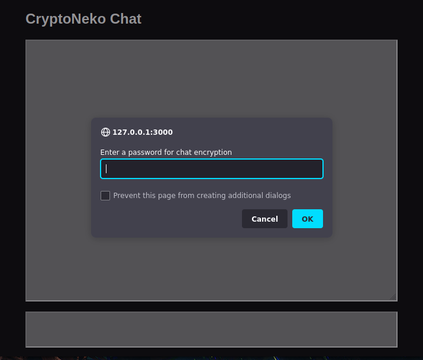

# CryptoNeko Chatroom

Another experimental secure messaging application. Loosely based on the original 
[cryptocat](https://en.wikipedia.org/wiki/Cryptocat) web client. Uses [js-nacl](https://github.com/tonyg/js-nacl) and [js-scrypt](https://github.com/tonyg/js-scrypt) javascript libraries to provide message encryption. May be suitable 
for situations where a low security but easy to use communications channel is 
needed, such as arguing about which secure messaging app to set up. This is a learning project and I make no guarantees about its security.

## Design 

- simple to setup multiuser chatroom with password based symettric encryption 
- in memory messages persistence with circular buffers (no database)
- full async web server with websockets and tornado (scalable, responsive)



## Setup

```python
pip install tornado 
python tornado-chat.py
```

Can be accessed at default port 3000 on localhost. Set up on your hosting 
service of choice or run as a tor hidden service.
